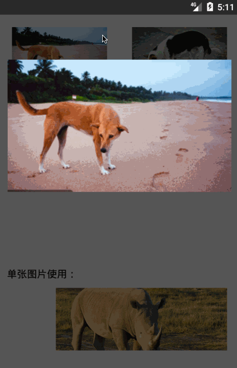
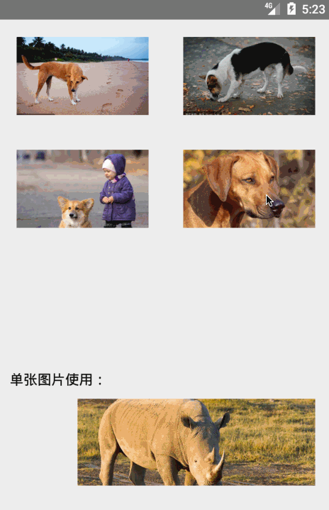

# DragPhotoViewer
完全模仿掘金Android App大图浏览拖拽效果！

# ScreenShot



# Gradle
[](https://bintray.com/li-xiaojun/jrepo/dragphotoviewer/latestVersion)

```
compile 'com.lxj.dragphotoviewer:dragphotoviewer:latest release'
```

# Usage
以下代码使用Kotlin编写。
```kotlin
// 多张图片
DragPhotoViewer(context)
    .setSrcView(view) // 设置动画起始View
    .setCurrentItem(position) // 设置默认显示哪个图片
    .setImageSize(list.size) // 设置图片个数
    .setLoadImageListener { position, imageView ->
        Glide.with(context).load(list[position]).into(imageView) // 我不负责如何加载图片，你来实现
    }
    .setOnUpdateSrcViewListener { viewer, position ->
        // 如果大图浏览时改变了page，你需要调用下面的方法设置对应position的View，否则缩放动画会缩小到最初设置的View
        viewer.setSrcView(recyclerView.getChildAt(position))
    }
    .show()


//单张图片
DragPhotoViewer(it.context)
    .setSrcView(iv)
    .setLoadImageListener { position, imageView ->
        Glide.with(it.context).load(list2[position]).into(imageView)
    }
    .show()

```